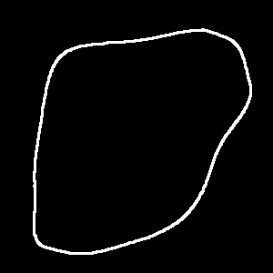

# Blob Masks

[](https://pypi.org/project/blob-masks/)
[](http://www.wtfpl.net/about/)

**Blob Masks** is a Python package that allows you to generate white, potato-shaped blobs on a black background. It's perfect for creating random mask patterns, image placeholders, or unique artistic effects.

## Installation

Install the package using pip:

```bash
pip install blob-masks
```

## Usage

Here's a basic example of how to use the `blob-masks` package:

```python
from blob_masks import blob_mask

# Generate a blob mask with default parameters
mask = blob_mask()

# Save the generated mask as an image
mask.save("blob.png")
```


You can customize the generated blobs by specifying additional parameters:

```python
from blob_masks import blob_mask

# Generate a blob mask with custom parameters
number_seed_blob = generate_blob(seed=42)
text_seed_blob = generate_blob(seed="Magnus", size=256)
```

You can also obtain the borders of the blob.

```python
from blob_masks import blob_mask, borders_of_blob

blob = blob_mask()
borders = borders_of_blob(blob, border_width=10)
```




## API

Both `blob_mask` and `borders_of_blob` return a `PIL.Image` object. The following parameters can be specified:

**`blob_mask`**:
 * `seed`: Seed of the blob, either a string or an integer (default: Random)
 * `size`: Height and width of the output image in pixels (default: 512)

**`borders_of_blob`**:
 * `blob`: The blob to get the borders of
 * `border_width`: Width of the border in pixels (default: 20)

## License

This project is licensed under the WTFPL License - see the [LICENSE](/LICENSE) file for details.
